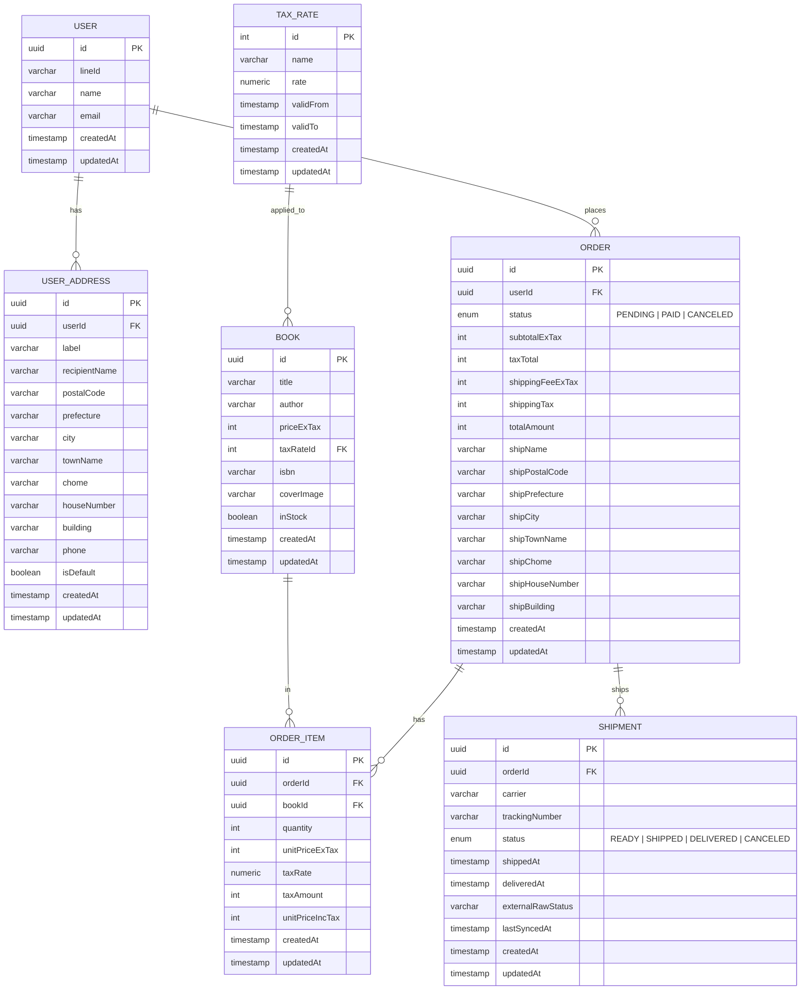

```mermaid
erDiagram
  USER ||--o{ USER_ADDRESS : has
  USER ||--o{ ORDER : places

  TAX_RATE ||--o{ BOOK : applied_to

  BOOK ||--o{ ORDER_ITEM : in
  ORDER ||--o{ ORDER_ITEM : has

  ORDER ||--o{ SHIPMENT : ships

  USER {
    uuid id PK
    varchar lineId
    varchar name
    varchar email
    timestamp createdAt
    timestamp updatedAt
  }
  USER_ADDRESS {
    uuid id PK
    uuid userId FK
    varchar label
    varchar recipientName
    varchar postalCode
    varchar prefecture
    varchar city
    varchar townName
    varchar chome
    varchar houseNumber
    varchar building
    varchar phone
    boolean isDefault
    timestamp createdAt
    timestamp updatedAt
  }
  TAX_RATE {
    int id PK
    varchar name
    numeric rate
    timestamp validFrom
    timestamp validTo
    timestamp createdAt
    timestamp updatedAt
  }
  BOOK {
    uuid id PK
    varchar title
    varchar author
    int priceExTax
    int taxRateId FK
    varchar isbn
    varchar coverImage
    boolean inStock
    timestamp createdAt
    timestamp updatedAt
  }
  ORDER {
    uuid id PK
    uuid userId FK
    enum status "PENDING | PAID | CANCELED"
    int subtotalExTax
    int taxTotal
    int shippingFeeExTax
    int shippingTax
    int totalAmount
    varchar shipName
    varchar shipPostalCode
    varchar shipPrefecture
    varchar shipCity
    varchar shipTownName
    varchar shipChome
    varchar shipHouseNumber
    varchar shipBuilding
    timestamp createdAt
    timestamp updatedAt
  }

  ORDER_ITEM {
    uuid id PK
    uuid orderId FK
    uuid bookId FK
    int quantity
    int unitPriceExTax
    numeric taxRate
    int taxAmount
    int unitPriceIncTax
    timestamp createdAt
    timestamp updatedAt
  }
  SHIPMENT {
    uuid id PK
    uuid orderId FK
    varchar carrier
    varchar trackingNumber
    enum status "READY | SHIPPED | DELIVERED | CANCELED"
    timestamp shippedAt
    timestamp deliveredAt
    varchar externalRawStatus
    timestamp lastSyncedAt
    timestamp createdAt
    timestamp updatedAt
  }
```
